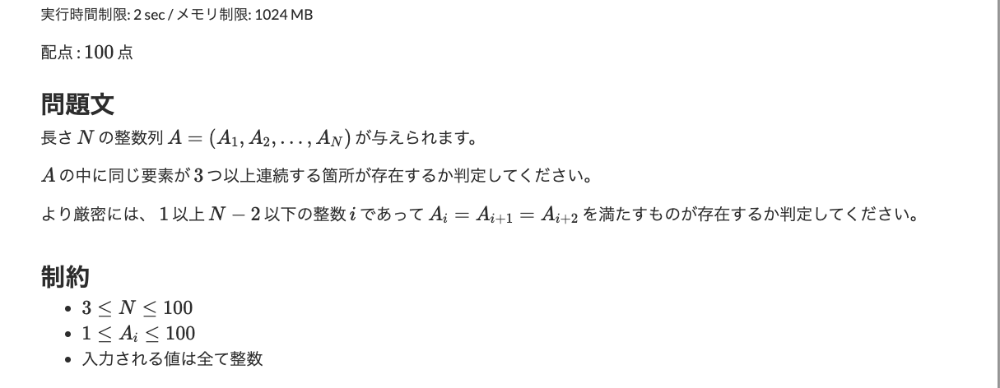

<!-- _class: lead -->

#### お家（House） ClickHouse で作る！誰でもアクセス可能な リアルタイム分析環境構築事例

**友岡湖太（cota）/ XiroGA3**

 

2025-03-12 | ClickHouse Meetup Tokyo

---

## Thank you!!

  <!-- 左側のテキスト -->
  

    

      このイベントに誘っていただいた Masato Suzuki さんありがとうございます
    

  

  <!-- 右側の画像 -->
  

    
  

---

<!-- 
header: お家 ClickHouse で作る！誰でもアクセス可能なリアルタイム分析環境構築事例
-->

## 自己紹介

  <!-- 左側のテキスト -->
  

    <h4>友岡湖太 / コタ</h4>
    <ul>
      <li>株式会社ユーザベース - ソフトウェアエンジニア</li>
      <li>Twitter: <a href="https://x.com/XiroGA3" target="_blank">@XiroGA3</a></li>
      <li>最近のマイブーム: スキー / サイクリング</li>
      <li>仕事ではバックエンドとインフラ、趣味でラズパイ使った弾道デバイス作ってます</li>
    </ul>
  

  <!-- 右側の画像 -->
  

    
  

---

## コンテンツ

1. 作っているもの

2. 簡単な構成について

3. なぜお家 ClickHouse x k8s という選択を？

4. ClickHouse について感じたこと

---

## 作っているもの

AtCoder Database (https://atcoder-db.sirogami.com)

誰でも気軽にAtCoderの情報を分析できる環境

---

## ？？？？

- なんのために作ったの？
- AtCoder とは？

---

## AtCoder とは？

 
 

日本最大のプログラミングを用いて戦う頭脳スポーツ「**競技プログラミング**」のコンテストサイト

---

## 競技プログラミング とは？

- 与えられた問題に対して、それを解くプログラムを提出する
- 解いた問題数や速さとかでレーティングが決まる

-> **どの言語がよく使われてるの？ 何問ぐらいとけばそのレーティングになれるの？**

---

## 有志による分析はあるけど...

**情報が古いのがほとんど**

- 年齢と使用プログラミング言語の相関(2023年)
  https://qiita.com/nabata/items/7c15a47f6a5caecadcc9
- 問題数と色(ランク)の関係(2021年)
  https://x.com/e869120/status/1428342253961895938
- レーティング分布(2019年)
  https://chokudai.hatenablog.com/entry/2019/02/11/155904

- etc...

---

## リアルタイムな分析結果を見たい

---

## AtCoder Database

AtCoder Database (https://atcoder-db.sirogami.com)

- AtCoder の全問題、全ユーザー、全提出約1億レコードを分析可能
- Metabase 経由で分析可能
- ClickHouse による高速な分析
- Google アカウントによる認証で誰でも使える（metabase 改造して誰でもサインアップ出来るように）

---

## リアルタイム分析

**イケてるグラフ**

---

## 簡単な構成について
- ミニPCでのお家 k3s (ワーカー3台、マスター1台構成)
- ClickHouseは左右端のPC(ノード)に2レプリカ1シャード形式 CPU Intel N100(4コア/4スレッド), メモリ 16GB(左), 12GB(右)
- その他のノードでCronJobや他のリソースを動かしています

---

## 使用しているツール群(ClickHouse)

- オンライン分析処理（OLAP）のための列指向SQLデータベース
- ミニPCでも10億行レベルの分析なら瞬時に可能

<!-- 下部に配置する ClickHouse カード（フッターとの余白あり） -->

  

    <h2 style="margin:0 0 8px 0; color:#222;">
      <strong>ClickHouse</strong>
    </h2>
    

      高性能なカラム指向データベース。大規模データのリアルタイム分析に最適なオープンソースDB。
    

    

      
      
      
    

  

  

---

## 使用しているツール群(Metabase)

- オープンソース(AGPL)のデータ可視化ツール
- Google アカウントによるシングルサインアップ
- pluginを入れることでClickHouseもデータソースとして使用可能

<!-- 下部に配置する Metabase カード（フッターとの余白あり） -->

  

    <h2 style="margin:0 0 8px 0; color:#222;">
      <strong>Metabase</strong>
    </h2>
    

      オープンソースのデータ可視化ツール。直感的なダッシュボードで、データ分析をサポートします。
    

    

      
      
      
    

  

  

---

## 使用しているツール郡(Cloudflare tunnel)

- 自宅のサーバーを無料で公開可能
- 軽量デーモンがエッジサーバーにアウトバウンド接続を確立

---

## なぜお家 k8s x ClickHouse を選んだ？

環境を作るうえで
**料金**、**容易に環境構築できるか**、**可用性**、**負荷分散**
の点を重視した

---

## 料金、クラウド

- クラウドで常時稼働のインスタンスを立てると高い...

  Google Cloud Compute Engine 2vCPUs,8GiB,500GB -> **$60~** 

  Google Cloud Compute Engine 4vCPUs,16GiB,500GB -> **$110~**

- DB だけじゃなく他のコンピューティングリソースも必要

  GKE Compute 2vCPUs,8GiB,500GB -> **$220~**

---

## 料金、お家サーバー

- ミニ PC を使った4ノード構成でお家サーバーで構築することに 
  DB用1 : intel N100(4コア,4スレッド), 12GB、メルカリで 15000 円 
  DB用2 : intel N100(4コア,4スレッド), 16GB、友達からもらったので無料
  その他 : ミニPC２つ、合計メルカリで 14000 円
  合計 : 29000円

- ランニングコスト 1000 円程度（電気代）

数ヶ月運用すればクラウドより安くなる計算

---

## ClickHouse Operator

- Altinity社が作成したClickHouseをKubernetesで管理するツール 
- ClickHouseのクラスタ構築、レプリケーションの構築（ZooKeeper, ClickHouse Keeper)が可能

  

    <h2 style="margin:0 0 8px 0; color:#222;">
      Altinity / <strong>ClickHouse Operator</strong>
    </h2>
    

      Kubernetes上でClickHouseクラスタをYAMLから簡単に自動運用するOperator。
    

    

      
      
      
    

  

  

---

## ClickHouse Operator のコード

2レプリカ1シャード、ClickHouse Keeper を使用した例 

  
  

---

### ClickHouse と k8s の組み合わせ

- ClickHouse Operator による容易なデプロイ
- 複数ノードにまたがるレプリケーションを瞬時に構築
- リソースの動的調整が可能
  - 友達がまた PC がくれるかも 

---

## ClickHouse について感じたこと

- データの投入は簡単、S3 や api 経由だったり様々な形式がサポートされている
https://zenn.dev/sirogami/scraps/7801394e34d10b
- 環境構築も楽、k8s 環境だったら ClickHouse Operator おすすめ
- レプリケーションを瞬時に構築
- 業務でもすぐ試すとかが数日でできそう

---

## ClickHouse について感じたこと

- 初期構築は楽だが、テーブルの構築はやっぱり大変
- ClickHouse 特有の概念が多い気がする、ReplacingMergeTree とか、マスタデータの扱いとか
- Tutorial は充実してる [Tutorial](https://learn.clickhouse.com/visitor_class_catalog/category/116050)
- ClickHouse の中の人にはよく助けてもらっています m(_ _)m
  - Twitter で ClickHouse 分からんって言ったらすぐ助けてくれる
  - 今回の登壇もそこから始まりました 

---

### ClickHouse について感じたこと

- Document が英語ばかり -> 03/11 に日本語版が出たようです！

<!-- 下部に配置する ClickHouse Documentation Card（フッターとの余白あり） -->

  

    <h2 style="margin: 0 0 8px 0; color: #222;">
      <strong>ClickHouseとは？</strong>
    </h2>
    

      ClickHouse®は、高性能で列指向のSQLデータベース管理システム（DBMS）で、オンライン分析処理（OLAP）に対応しています。オープンソースソフトウェアとしても、クラウドベースの提供としても利用可能です。
    

    

      <a href="https://clickhouse.com/docs/jp/intro" target="_blank" style="text-decoration: none; color: #3E8ED0; font-weight: bold;">
         詳細はこちら
      </a>
    

  

---

### 終わり

